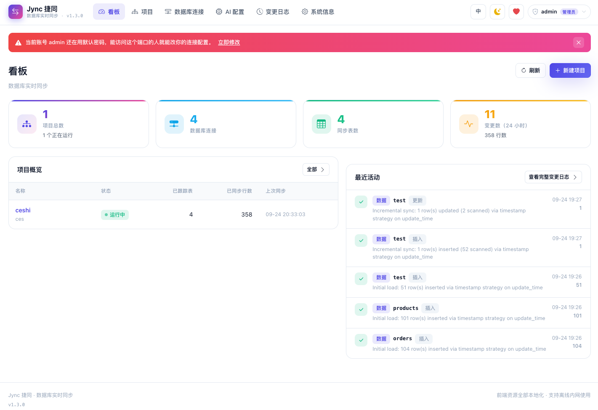
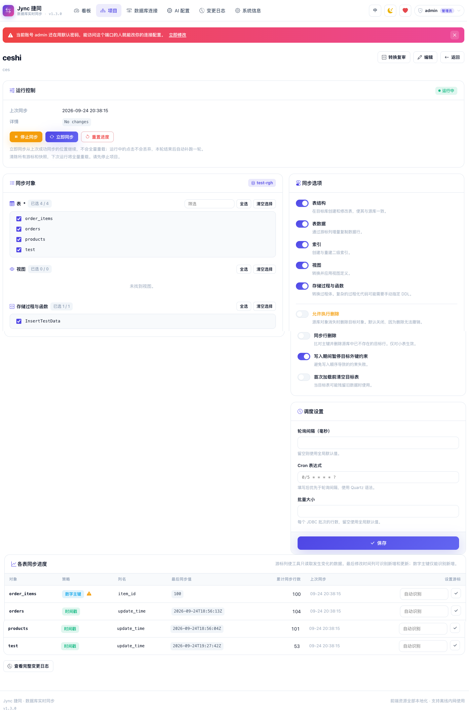
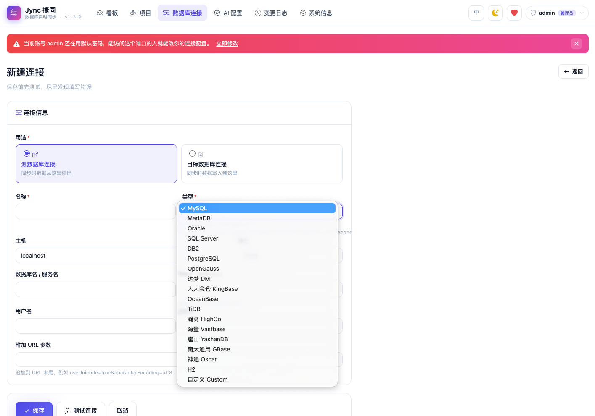
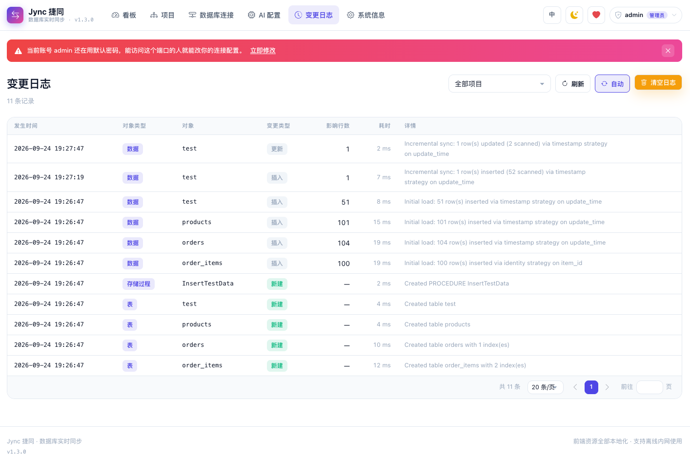

# Jync 捷同 · 最受欢迎的异构数据库实时同步工具

> 单 JAR 开箱即用 —— 不要 Kafka，不要 ZooKeeper，不要一行代码。
> 项目地址：[GitHub](https://github.com/vfaner/jync) ｜ [Gitee 镜像](https://gitee.com/super_rgh/jync) ｜ [14 分钟演示视频](https://www.bilibili.com/video/BV1iHYJ6vEEd)
> 下载地址：[GitHub Releases](https://github.com/vfaner/jync/releases/latest) ｜ [Gitee Releases](https://gitee.com/super_rgh/jync/releases/latest) ｜ [详细教程](https://jync.qqmu.com/deploy.html)

## 开发背景

企业里异构数据库长期共存是常态：老系统跑在 Oracle / SQL Server 上，新业务选 MySQL / PostgreSQL，信创环境还要落地达梦、金仓等国产库。而现有的同步方案两极分化——Debezium、Flink CDC 这类流式框架能力虽强，却要搭上 Kafka、ZooKeeper 一整套基础设施，还要求源库开 binlog、申请复制权限；DataX、Navicat 数据传输则只解决"搬一次"，不管"持续一致"。中小规模、部门级的同步需求，长期卡在"杀鸡用牛刀"和"无刀可用"之间。Jync 就是为填这个空档而写的：**把任意两种异构数据库之间的持续同步，做成分钟级部署、零外部依赖的开箱即用应用**。

## 项目介绍

Jync（读作 "sync"，J 代表 Java；捷同：敏捷同步，两库皆同）是一个在异构数据库之间**实时同步结构与数据**的 Web 应用。单个 jar 启动，浏览器点几下，即可在内置 17 种数据库（另支持自定义类型）之间任意两种建立持续同步链路——Oracle → PostgreSQL、MySQL → 达梦只是其中两个例子。源库只需要一个只读账号，不开 binlog、不建触发器。

核心能力：

- **结构 + 数据一起同步**：按目标库方言自动建表、索引、视图、存储过程，源库 DDL 变更后差异自动传播；
- **持续增量**：默认 2 秒轮询，也可用 Cron 编排；进程重启从游标继续，停机期间的变更自动补齐；
- **不丢不重**：闭区间增量窗口 + 提交后才推进游标 + 按主键幂等 upsert，崩溃重放也收敛到同一状态；
- **看得见的同步**：看板展示项目数、连接数、24 小时变更量；变更日志记录每次同步的对象、行数、耗时与错误详情；
- **国产库一等公民**：达梦、金仓、OceanBase、TiDB、瀚高、海量、崖山、GBase、神通、OpenGauss 均有专门方言实现；
- **内网离线可用**：前端资源全内置，运行时零外部请求；中英文界面、昼夜主题；
- **AI 辅助（可选）**：存储过程方言转换可由模型起草候选，人工审阅后才落库，同步链路永不调用 AI。

### 与同类工具对比的优势

| 维度 | **Jync** | Debezium + Kafka | Canal | DataX / Navicat 数据传输 |
|---|---|---|---|---|
| 部署形态 | **单个 jar，零外部依赖** | Kafka + Connect + ZK | Canal Server | 客户端脚本 / 桌面端 |
| 持续增量同步 | ✅ 轮询 / Cron | ✅ 但需自写消费代码 | ✅ 仅 MySQL | ❌ 一次性搬运 |
| 结构（DDL）同步 | ✅ 自动建表/索引/视图/过程 | ⚠️ 落库需自写 | ⚠️ 仅事件 | ❌ 需预建表 |
| 国产数据库 | ✅ 10 种预设方言 | ❌ 基本不支持 | ❌ | ⚠️ 部分 |
| 源库侵入性 | **只读账号，零侵入** | 需开 binlog/wal + 复制权限 | 需开 binlog | 只读（但仅一次性） |
| 上手成本 | **分钟级** | 高 | 中高 | 低（但不解决持续同步） |

一句话总结：**规模配不上一套流式基础设施的同步需求，Jync 是更合适的答案**。当然边界也说清楚：毫秒级延迟、单表数亿行一次性初始化、复杂 ETL、多主双向复制，请选对应的专业工具。

## 技术栈

- **Java 17 + Spring Boot 2.7** 单体架构，Spring Data JPA；
- **Thymeleaf 服务端渲染** + 原生 JS + 手写 CSS（设计令牌），无前端框架、无构建步骤；
- **Quartz** 调度 + 三层锁（调度注解 / JVM 锁 / 数据库锁行租约）保证单实例执行；
- **H2 内嵌元数据库**：连接、项目、游标、锁、变更日志全部自管理，无需另装数据库；
- 14 个 JDBC 驱动随包内置，GBase / 神通等外部驱动运行时动态加载、ClassLoader 隔离；
- 410 个单元测试 + 20 项端到端断言兜底。

## 运行方法

```bash
git clone https://github.com/vfaner/jync.git   # 国内：git clone https://gitee.com/super_rgh/jync.git
cd jync
mvn clean package -DskipTests
java -jar target/jync.jar
```

不想从源码构建的话，也可以直接从 Releases 下载成品 `jync.jar`（[GitHub](https://github.com/vfaner/jync/releases/latest) / [Gitee](https://gitee.com/super_rgh/jync/releases/latest)），`java -jar jync.jar` 一条命令启动。

浏览器打开 `http://localhost:8080`，默认账号 `admin / 123456`（**首次登录后请立即改密**，未改密前页面会一直挂红色警告）。接下来的使用流程只有五步：建源库连接 → 建目标库连接 → 新建项目选两端 → 勾选要同步的表/视图/存储过程 → 点「启动同步」。生产环境建议用 systemd 托管，并修改 `application.yml` 中的 `sync.crypto-password` 与 `crypto-salt`；生产配置、后台常驻、外部驱动加载等更完整的部署说明见[详细教程](https://jync.qqmu.com/deploy.html)。

## 效果截图


看板：项目数、连接数、同步表数、24 小时变更量与最近活动一屏掌握


项目详情：表/视图/存储过程逐表勾选，每张表的增量检测策略直接标注


新增连接：先定源/目标用途，类型选好 JDBC URL 自动拼装，测通再保存


变更日志：每次变更的对象、类型、影响行数、耗时与错误详情均可追溯

## 结语

Jync 基于 MIT 协议开源，商业与非商业用途均可。如果你也受够了"为同步两张库搭一套 Kafka"或者"每次改表结构手动对齐两边"，欢迎试试它——顺手点个 Star ⭐、提个 Issue 就更好了。
